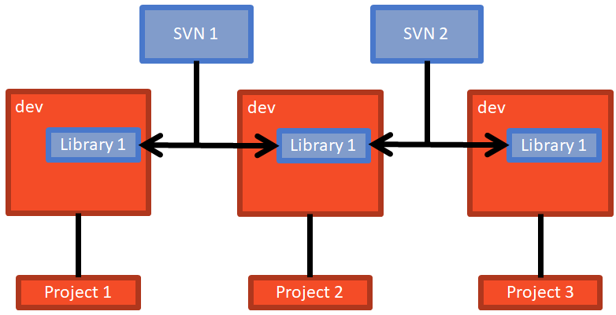

# Managing library code across multiple projects

This document details my process for managing many libraries used in many projects, and keeping the code in sync across all the combinations.

## Problem

You have suite of libraries you would like to use in multiple projects. You would like to vendor the code for stability, but you would also like to update the code as if it belongs to the project. Some examples are:
 
* **personal toolbox** - the conglomeration of utility functions you are familiar with
* **facades** - Domain-specific simplification of 3rd party modules to avoid boilerplate code.
* **maturing frameworks** - code meant to be a formal library, but too immature at this time
* **forked repos** - 3rd party code that must enhanced, but will not be accepted by upstream in a timely manner
 
## Existing Solutions

The existing solutions are time consuming, or confusing.

### Packaged projects?

Packages provide the required portability between various projects, but they suffer from synchonization problems. Either a bug must be fixed in a library before project work can be resumed, or the API to a library is changing,   

* while debugging `Project-1` 
* you see a bug in `Library_1` code
* you switch to the `Library_1` project
* you change the `Library_1` code
* you package `Library-1`
* you update `Library-1` package in `Project-1`
* you resume debugging `Project-1`

This is fine for mature projects; the code is stable and production quality; it is unlikely you will need a bug fixed in the library, and the few bugs in the library are unlikely to affect your use cases.

If a library is still changing, or if it still needs stabilization work, then packaged projects make it difficult to change the library code. 


### Single Repo?

Storing all your code in a single repo allows you to change both the project code and the library code together. There are detriments:

* All projects must be in the same repo to benefit from the library code
* Repo can get enormous, 
* Test cases get enormous; most of which will be irrelevant to a particular project
* Difficult to teach what is important to a single project 
* You can not share library code with yet-more projects 


Starting a new project is difficult because you must import, in one way or another, your personal suite of useful code.  


```
Project_1
  |
  +-- vendor
        |
        +-- Library_1
        |
        +-- Library_2
```


Here is a diagram of a git repo, with three branches, each with (some version of) library code 


## Solution: Two version control systems

Your projects will be managed with one VCS, and your libraries will be synched with another VCS. In this document we will assume Git and Subversion respectively.  Each has particular properties that are well suited to synchronizing libraries in this manner   

You can use this technique on all your vendor libraries. It helps especially when your vendor code lacks comprehensive tests: Each project that uses your vendor library effectively acts as a test suite.

> **This technique is only needed if you are synchronizing libraries across more then one project. Contributors to your projects need not know about this**


## Overview

We will use the following directory pattern to allow both vcs' to track the project and library code. This will be explained in more detail below.


```
Project-1
  |
  +- .git
  |
  +-- Project_1
  |
  +-- vendor 
  |    |
  |    +-- Library_1
  |    |     |
  |    |     +-- .svn
  |    |
  |    +-- Library_2
  |          |
  |          +-- .svn
  |
  +-- tests
```

Please notice 

* projects are named with dashes (`-`), eg `Project-1`
* code subdirectories are named with underscore (`_`), eg `Project_1`

### Project Setup

Setup Subversion host your library

    svn mkdir svn://localhost/libraries/my_library

> I installed SVN locally so I can perform cross-project synching while offline (and it is faster).


Subversion is very good a tracking subdirectories independently. Notice you can use one Subversion repo, called `libraries`, and put each library in a separate subdirectory.

Ensure `my-project` has a `dev` branch on `git`
    
    git checkout -b dev

make a new `svn` repo to track the `vendor/my_library` directory
    
    cd my-project/vendor
    svn checkout svn://localhost/my_library


### Project Synchronization

If you have two projects with vendored `my_library` you probably will want to occasionally synch them:


Ensure you are on `dev` branch

    git checkout dev

Update library with changes from other projects

	svn update --accept p vendor/my_library

Commit those changes, for good measure

    git add -A
    git commit -m "lib updates"

Ensure you push your library updates to Subversion so other projects can use it

    svn commit vendor\my_library -m "lib updates"

> I use TortoiseSVN to perform the syncing (it shows the files I forgot to add)

## Library as a project

If a library is big enough, it may require tests, configuration, and deployment resources. It is not recommended for small libraries because there are project support costs. (repo, issues, deployment, etc).


```
my-library
  |
  +- .git
  |
  +- my_library
  |    |
  |    +- .svn
  |
  +- tests
```

### Library Setup 

Make a Git repo for your library-as-a-project, then clone it

    git clone my-library

Ensure you have a `dev` branch

    gti checkout -b dev

Checkout the library code from Subversion into your code directory

	cd my-library
    svn checkout svn://localhost/my_library

Please notice that only the code is tracked with Subversion.  


### Library Synchronization

Syncing a library is much like syncing a vendor directory.


Ensure you are on `dev` branch      

    git checkout dev

Update library with changes from other projects

    cd my-library
	svn update --accept p my_library

Commit those changes, for good measure

    git add -A
    git commit -m "lib updates"

Ensure you push your library updates to Subversion so other projects can use it

    svn commit my_library -m "lib updates"

## Distributed Library Propagation

A system with two svn servers allows third party projects to propagate library updates 



In the diagram above, we can assume there are two programmers (1 and 2), each with their own local SVN repository containing shared libraries. Programmer1 can propagate changes from `project1` to `project2`.  After programmer1 pushes updates to `project2`, programmer3 can pull those changes and propagate them to `project3`. 
  

